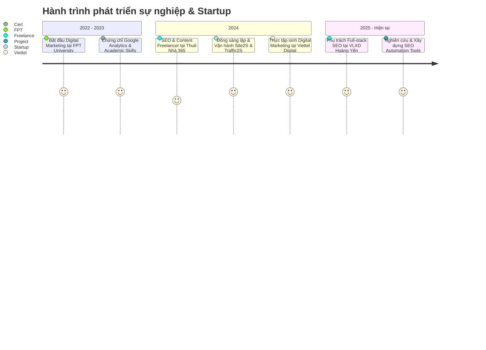

  <!-- Header Banner / Intro -->
  

  

    
    
    
    
    
  

  

    
  

---

### 👨‍💻 Về tôi (About Me)

Xin chào! Mình là **Nguyễn Bá Ất (Kong Real)** — Sinh viên Digital Marketing tại **FPT University**, định hướng chuyên sâu **SEO, Content Strategy & Growth Hacking**.

- 🎯 **Mục tiêu:** Trở thành **SEO Specialist** trong môi trường công nghệ chuyên nghiệp, tập trung tăng trưởng Organic Traffic bền vững và tối ưu hóa tỷ lệ chuyển đổi dựa trên dữ liệu thực tế (Data-driven).
- 🚀 **Kinh nghiệm thực chiến:** Đã trực tiếp xây dựng, đồng sáng lập và vận hành các nền tảng tự động hóa traffic với hàng ngàn người dùng hoạt động hàng tháng.
- 💡 **Châm ngôn sống:** *"用钱解决不了的事情，就用更多的钱解决。"*

---

### 📊 Điểm nhấn thành tựu (Key Highlights)

| 🏆 Dự án / Trải nghiệm | 📈 Kết quả đo lường thực tế |
| :--- | :--- |
| **Viettel Digital** *(Intern SEO & Content)* | 🎯 **160** từ khóa lên **Trang 1 Google**   📌 **434** từ khóa lọt **TOP 20**   🚀 **601** từ khóa lọt **TOP 50** với 54 bài viết chuyên sâu |
| **Site2S.com** *(Co-founder & Manager)* | 👥 Đạt **2.000+** người dùng thường xuyên sau 12 tháng   🌐 Xử lý **hàng trăm ngàn lượt truy cập/tháng**, tạo thu nhập cho Publishers |
| **Traffic2S.com** *(Co-founder & Manager)* | ⚙️ **Tự động hóa 80%** quy trình phân phối traffic đẩy Top SEO   📦 Xử lý hàng ngàn đơn hàng & doanh thu tự động |

---

### 🛠 Kỹ năng & Công cụ (Tech Stack & Toolkit)

<table>
  <tr>
    <td width="20%" align="center"><b>🔍 SEO & Growth</b></td>
    <td>
      
      
      
      
      
      
      
    </td>
  </tr>
  <tr>
    <td width="20%" align="center"><b>💻 Web & Tech</b></td>
    <td>
      
      
      
      
      
    </td>
  </tr>
  <tr>
    <td width="20%" align="center"><b>🎨 Thiết kế & Media</b></td>
    <td>
      
      
      
      
      
    </td>
  </tr>
  <tr>
    <td width="20%" align="center"><b>📈 Dữ liệu & Văn phòng</b></td>
    <td>
      
      
      
    </td>
  </tr>
</table>

---

### 💼 Lộ trình sự nghiệp (Experience & Career Journey)

- 🏢 **[Site2S](https://site2s.com/)** *(09/2024 — Hiện tại)* — **Co-founder & Manager**  
  *Xây dựng & vận hành nền tảng rút gọn link kiếm tiền, phục vụ 2.000+ active users & hàng trăm nghìn visits/tháng.*
- 🚀 **[Traffic2S](https://traffic2s.com/)** *(09/2024 — Hiện tại)* — **Co-founder & Manager**  
  *Phát triển hệ thống phân phối & trao đổi traffic SEO tự động 80%, giải quyết bài toán ranking bền vững.*
- 🔴 **Viettel Digital** *(09/2024 — 01/2025)* — **Intern Digital Marketing**  
  *Nghiên cứu từ khóa & sản xuất 54 bài viết chuẩn SEO, đưa 160 từ khóa vào Trang 1 Google.*
- 🏗️ **[VLXD Hoàng Yến](https://vlxdhoangyen.com/)** *(2025 — Hiện tại)* — **Full-stack SEO Freelancer**  
  *Xây dựng website chuẩn Silo, On-page/Off-page, quản trị GSC/GA4 và hệ thống truyền thông số.*
- 🏠 **[Thuê Nhà 365](https://thuenha365.com/)** *(01/2024 — 01/2025)* — **Content & SEO Freelancer**  
  *Tối ưu nội dung bất động sản chuẩn SEO, thiết kế hình ảnh & tối ưu phễu chuyển đổi qua Fanpage.*

---

### 🚀 Dự án đang phát triển (In-Progress Projects)

- ⚡ **SEO Content Assistant Web App** `[35% Hoàn thiện]`
  - Công cụ hỗ trợ viết bài chuẩn SEO On-page: phân tích Title, Meta Tag, Heading (H1-H6), Core Web Vitals, Internal Links & mật độ từ khóa theo thời gian thực.
  - *Tech stack:* `JavaScript` • `REST API` • `SEO Algorithms`

---

### 🎓 Học vấn & Chứng chỉ (Education & Certifications)

- 🎓 **FPT University** — *Cử nhân Digital Marketing (2022 — Hiện tại)*
- 📜 **Google Analytics Certification** *(Google — 2023)*
- 📜 **HR for People Managers** *(2023)*
- 📜 **Chứng chỉ Tin học nghề & University Success** *(2021 & 2023)*

---

### 📈 Thống kê GitHub (GitHub Stats)

  
  

---

### 📬 Kết nối cùng tôi (Get in Touch)

  
Bạn đang tìm kiếm cộng sự phát triển dự án SEO, tăng trưởng Traffic hoặc cơ hội hợp tác Marketing?

  
  
  
  

    
  © 2026 <b>Nguyễn Bá Ất</b> (KongReal) • Designed for GitHub Profile

